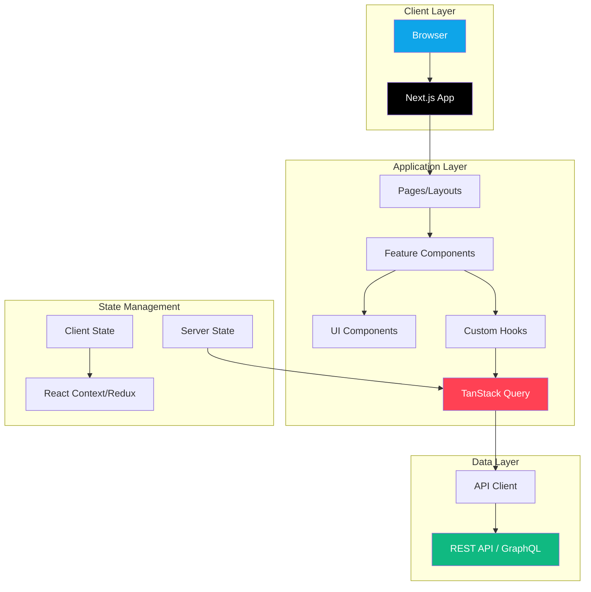
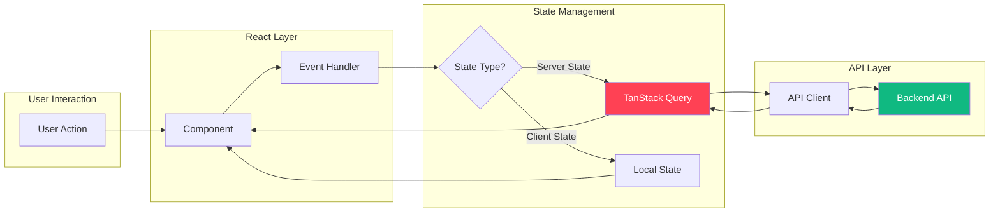
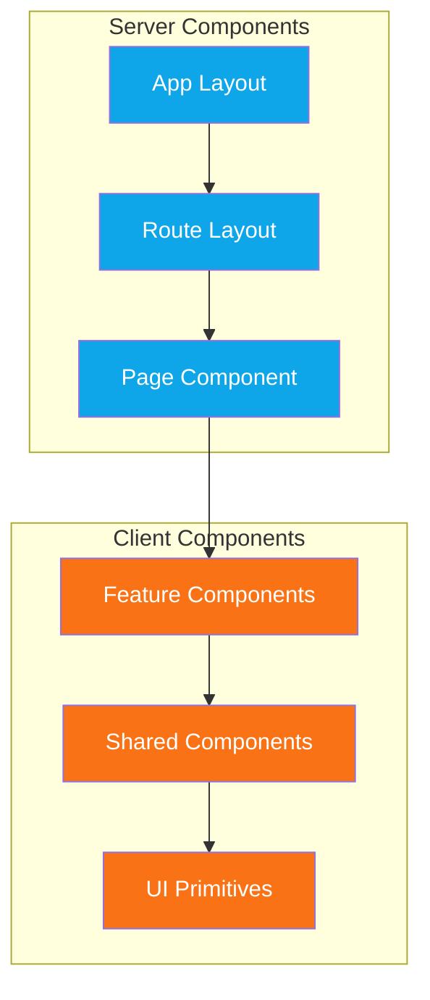

import { Card, Cards } from "fumadocs-ui/components/card";
import { Callout } from "fumadocs-ui/components/callout";
import { Tab, Tabs } from "fumadocs-ui/components/tabs";

# 🏗️ Architecture

<Callout type="info">
  This document describes our architectural patterns, project structure, and the
  reasoning behind our technical decisions.
</Callout>

## Architecture Overview



## Core Principles

<Cards>
  <Card
    title="🧩 Composition over Inheritance"
    description="Build complex functionality by combining simple, focused components"
  />
  <Card
    title="🎯 Single Responsibility"
    description="Each component, hook, or function has one clear purpose"
  />
  <Card
    title="📦 Feature-Based Organization"
    description="Group code by feature, not by type"
  />
  <Card
    title="🔄 Separation of Concerns"
    description="Keep UI, logic, and data fetching separate"
  />
</Cards>

## Data Flow Architecture



## Component Hierarchy



## Project Structure

### Next.js App Router Structure

```
src/
├── app/                          # Next.js App Router
│   ├── (auth)/                   # Auth route group
│   │   ├── login/
│   │   │   └── page.tsx
│   │   └── register/
│   │       └── page.tsx
│   ├── (dashboard)/              # Dashboard route group
│   │   ├── layout.tsx            # Shared dashboard layout
│   │   ├── page.tsx              # Dashboard home
│   │   ├── users/
│   │   │   ├── page.tsx          # Users list
│   │   │   └── [id]/
│   │   │       └── page.tsx      # User detail
│   │   └── settings/
│   │       └── page.tsx
│   ├── api/                      # API routes
│   │   └── auth/
│   │       └── [...nextauth]/
│   │           └── route.ts
│   ├── layout.tsx                # Root layout
│   ├── page.tsx                  # Home page
│   └── globals.css               # Global styles
│
├── components/
│   ├── ui/                       # Base UI components (Shadcn)
│   │   ├── button.tsx
│   │   ├── card.tsx
│   │   ├── input.tsx
│   │   └── ...
│   ├── layout/                   # Layout components
│   │   ├── header.tsx
│   │   ├── sidebar.tsx
│   │   └── footer.tsx
│   └── shared/                   # Shared feature components
│       ├── data-table.tsx
│       └── file-upload.tsx
│
├── features/                     # Feature modules
│   ├── users/
│   │   ├── components/
│   │   │   ├── user-card.tsx
│   │   │   ├── user-form.tsx
│   │   │   └── user-list.tsx
│   │   ├── hooks/
│   │   │   └── use-users.ts
│   │   ├── services/
│   │   │   └── user-service.ts
│   │   ├── types/
│   │   │   └── user.ts
│   │   ├── validations/
│   │   │   └── user-schema.ts
│   │   └── index.ts
│   └── orders/
│       └── ...
│
├── hooks/                        # Shared hooks
│   ├── use-debounce.ts
│   ├── use-local-storage.ts
│   └── use-media-query.ts
│
├── lib/                          # Utilities
│   ├── api.ts                    # API client
│   ├── utils.ts                  # Helper functions
│   └── constants.ts              # App constants
│
├── store/                        # Redux store (if used)
│   ├── store.ts
│   ├── hooks.ts
│   └── slices/
│       └── cart-slice.ts
│
├── types/                        # Shared types
│   ├── api.ts
│   └── common.ts
│
└── providers/                    # React context providers
    ├── theme-provider.tsx
    └── query-provider.tsx
```

## Architectural Patterns

### Component Architecture

```
┌─────────────────────────────────────────────────────┐
│                    Page Component                    │
│  (src/app/users/page.tsx)                           │
│  - Server Component (default)                        │
│  - Data fetching                                     │
│  - SEO metadata                                      │
└─────────────────────────────────────────────────────┘
                         │
                         ▼
┌─────────────────────────────────────────────────────┐
│               Feature Components                     │
│  (src/features/users/components/)                   │
│  - Client Components when needed                     │
│  - Business logic                                    │
│  - Feature-specific UI                               │
└─────────────────────────────────────────────────────┘
                         │
                         ▼
┌─────────────────────────────────────────────────────┐
│                  UI Components                       │
│  (src/components/ui/)                               │
│  - Reusable primitives                               │
│  - No business logic                                 │
│  - Highly composable                                 │
└─────────────────────────────────────────────────────┘
```

### Data Flow

<Tabs items={["🖥️ Server", "🖱️ Client", "🔀 Hybrid"]}>
  <Tab value="Server Components">
```tsx
// src/app/users/page.tsx
// Server Component - fetches data on server
import { UserList } from "@/features/users/components/user-list";

async function getUsers() {
const res = await fetch(`${process.env.API_URL}/users`, {
next: { revalidate: 60 }, // ISR
});
return res.json();
}

export default async function UsersPage() {
  const users = await getUsers();

return (

<main>
  <h1>Users</h1>
  <UserList users={users} />
</main>
); }

````
</Tab>
  <Tab value="Client Components">
```tsx
// src/features/users/components/user-list.tsx
"use client";

import { useUsers } from "../hooks/use-users";
import { UserCard } from "./user-card";

export function UserList() {
  const { data: users, isLoading, error } = useUsers();

  if (isLoading) return <UserListSkeleton />;
  if (error) return <ErrorState error={error} />;
  if (!users?.length) return <EmptyState />;

  return (
    <div className="grid gap-4">
      {users.map((user) => (
        <UserCard key={user.id} user={user} />
      ))}
    </div>
  );
}
````

</Tab>
  <Tab value="🔀 Hybrid">
```tsx
// src/app/users/page.tsx
// Server Component with client children
import { Suspense } from "react";
import { UserFilters } from "@/features/users/components/user-filters";
import { UserListServer } from "@/features/users/components/user-list-server";
import { UserListSkeleton } from "@/features/users/components/user-list-skeleton";

interface Props {
searchParams: { search?: string; role?: string };
}

export default function UsersPage({ searchParams }: Props) {
  return (
    <main>
      <h1>Users</h1>
      {/* Client Component for interactivity */}
      <UserFilters />
      {/* Server Component with Suspense */}
      <Suspense fallback={<UserListSkeleton />}>
        <UserListServer filters={searchParams} />
      </Suspense>
    </main>
  );
}
```
</Tab>
</Tabs>

### State Management Strategy

```
┌────────────────────────────────────────────────────────────────┐
│                        State Types                              │
├────────────────────────────────────────────────────────────────┤
│                                                                 │
│  ┌─────────────┐  ┌─────────────┐  ┌─────────────────────────┐ │
│  │ UI State    │  │ Server State│  │ Application State       │ │
│  │             │  │             │  │                         │ │
│  │ - Modal     │  │ - API Data  │  │ - Shopping Cart         │ │
│  │ - Sidebar   │  │ - User Data │  │ - User Preferences      │ │
│  │ - Tabs      │  │ - Lists     │  │ - Feature Flags         │ │
│  │             │  │             │  │                         │ │
│  │ useState    │  │ TanStack    │  │ Redux Toolkit           │ │
│  │ useReducer  │  │ Query       │  │ or Zustand              │ │
│  └─────────────┘  └─────────────┘  └─────────────────────────┘ │
│                                                                 │
└────────────────────────────────────────────────────────────────┘
```

## Feature Module Pattern

Each feature is self-contained with everything it needs:

```
features/users/
├── components/           # Feature UI
│   ├── user-card.tsx
│   ├── user-form.tsx
│   ├── user-list.tsx
│   └── user-skeleton.tsx
├── hooks/                # Feature hooks
│   ├── use-users.ts
│   ├── use-user.ts
│   └── use-create-user.ts
├── services/             # API layer
│   └── user-service.ts
├── types/                # TypeScript types
│   └── user.ts
├── validations/          # Zod schemas
│   └── user-schema.ts
├── utils/                # Feature utilities
│   └── user-utils.ts
└── index.ts              # Public exports
```

### Public API (index.ts)

```tsx
// features/users/index.ts
// Only export what other features need

// Components
export { UserCard } from "./components/user-card";
export { UserList } from "./components/user-list";
export { UserForm } from "./components/user-form";

// Hooks
export { useUsers } from "./hooks/use-users";
export { useUser } from "./hooks/use-user";
export { useCreateUser } from "./hooks/use-create-user";

// Types
export type { User, CreateUserInput, UpdateUserInput } from "./types/user";

// Validations
export { userSchema, createUserSchema } from "./validations/user-schema";
```

## API Architecture

### API Client

```tsx
// src/lib/api.ts
import { getSession } from "next-auth/react";

const BASE_URL = process.env.NEXT_PUBLIC_API_URL;

class ApiError extends Error {
  constructor(public status: number, message: string) {
    super(message);
    this.name = "ApiError";
  }
}

async function getAuthHeaders(): Promise<HeadersInit> {
  const session = await getSession();
  const headers: HeadersInit = {
    "Content-Type": "application/json",
  };

  if (session?.accessToken) {
    headers.Authorization = `Bearer ${session.accessToken}`;
  }

  return headers;
}

async function handleResponse<T>(response: Response): Promise<T> {
  if (!response.ok) {
    if (response.status === 401) {
      // Handle unauthorized
      window.location.href = "/login";
    }
    throw new ApiError(response.status, response.statusText);
  }
  return response.json();
}

export const api = {
  async get<T>(endpoint: string): Promise<T> {
    const headers = await getAuthHeaders();
    const response = await fetch(`${BASE_URL}${endpoint}`, {
      method: "GET",
      headers,
    });
    return handleResponse<T>(response);
  },

  async post<T>(endpoint: string, data?: unknown): Promise<T> {
    const headers = await getAuthHeaders();
    const response = await fetch(`${BASE_URL}${endpoint}`, {
      method: "POST",
      headers,
      body: data ? JSON.stringify(data) : undefined,
    });
    return handleResponse<T>(response);
  },

  async patch<T>(endpoint: string, data?: unknown): Promise<T> {
    const headers = await getAuthHeaders();
    const response = await fetch(`${BASE_URL}${endpoint}`, {
      method: "PATCH",
      headers,
      body: data ? JSON.stringify(data) : undefined,
    });
    return handleResponse<T>(response);
  },

  async delete<T>(endpoint: string): Promise<T> {
    const headers = await getAuthHeaders();
    const response = await fetch(`${BASE_URL}${endpoint}`, {
      method: "DELETE",
      headers,
    });
    return handleResponse<T>(response);
  },
};
```

### Service Layer

```tsx
// features/users/services/user-service.ts
import { api } from "@/lib/api";
import { userSchema, usersSchema } from "../validations/user-schema";
import type { User, CreateUserInput } from "../types/user";

export const userService = {
  async getUsers(): Promise<User[]> {
    const data = await api.get<unknown>("/users");
    return usersSchema.parse(data);
  },

  async getUser(id: string): Promise<User> {
    const data = await api.get<unknown>(`/users/${id}`);
    return userSchema.parse(data);
  },

  async createUser(data: CreateUserInput): Promise<User> {
    const response = await api.post<unknown>("/users", data);
    return userSchema.parse(response);
  },

  async updateUser(id: string, data: Partial<User>): Promise<User> {
    const response = await api.patch<unknown>(`/users/${id}`, data);
    return userSchema.parse(response);
  },

  async deleteUser(id: string): Promise<void> {
    await api.delete(`/users/${id}`);
  },
};
```

## Error Handling

### Error Boundary Pattern

```tsx
// src/components/error-boundary.tsx
"use client";

import { Component, ReactNode } from "react";

interface Props {
  children: ReactNode;
  fallback?: ReactNode;
}

interface State {
  hasError: boolean;
  error?: Error;
}

export class ErrorBoundary extends Component<Props, State> {
  state: State = { hasError: false };

  static getDerivedStateFromError(error: Error): State {
    return { hasError: true, error };
  }

  componentDidCatch(error: Error, errorInfo: React.ErrorInfo) {
    console.error("Error caught:", error, errorInfo);
    // Report to error tracking service
  }

  render() {
    if (this.state.hasError) {
      return this.props.fallback || <DefaultErrorFallback />;
    }
    return this.props.children;
  }
}
```

### Next.js Error Pages

```tsx
// src/app/error.tsx
"use client";

interface Props {
  error: Error & { digest?: string };
  reset: () => void;
}

export default function Error({ error, reset }: Props) {
  return (
    <div className="flex min-h-screen flex-col items-center justify-center">
      <h2 className="text-2xl font-bold">Something went wrong!</h2>
      <p className="text-muted-foreground">{error.message}</p>
      <button onClick={reset} className="mt-4">
        Try again
      </button>
    </div>
  );
}
```

## Performance Patterns

### Code Splitting

```tsx
import dynamic from "next/dynamic";

// Lazy load heavy components
const Chart = dynamic(() => import("@/components/chart"), {
  loading: () => <ChartSkeleton />,
  ssr: false, // Disable SSR for client-only components
});

// Lazy load based on viewport
const LazySection = dynamic(() => import("./lazy-section"), {
  loading: () => <SectionSkeleton />,
});
```

### Image Optimization

```tsx
import Image from "next/image";

// Always use Next.js Image component
<Image
  src="/hero.jpg"
  alt="Hero image"
  width={1200}
  height={600}
  priority // For above-the-fold images
  placeholder="blur"
  blurDataURL={blurDataUrl}
/>;
```

## Decision Records

### Why Next.js App Router?

- **Server Components** - Better performance, smaller bundles
- **Streaming** - Progressive rendering with Suspense
- **Layouts** - Nested layouts with shared state
- **Parallel Routes** - Complex UI patterns
- **Intercepting Routes** - Modal patterns

### Why TanStack Query over Redux for Server State?

- **Built-in caching** - Automatic request deduplication
- **Background updates** - Stale-while-revalidate
- **Optimistic updates** - Better UX for mutations
- **DevTools** - Excellent debugging experience
- **Less boilerplate** - Simpler than Redux Thunk/Saga

### Why Zod for Validation?

- **TypeScript-first** - Automatic type inference
- **Runtime validation** - Catch errors from APIs
- **Composable** - Build complex schemas from simple ones
- **Error messages** - Customizable, user-friendly errors
