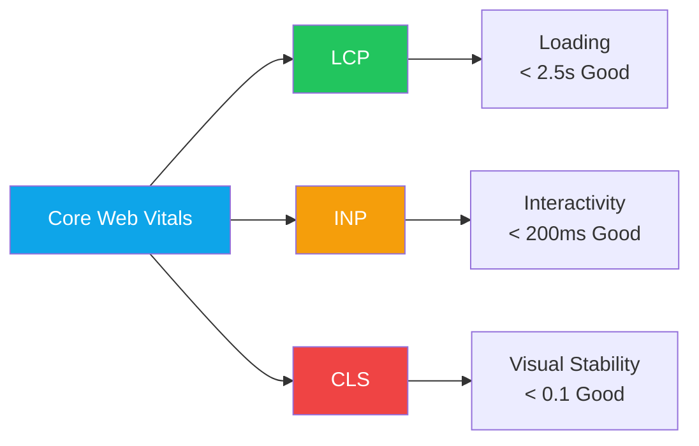

import { Card, Cards } from "fumadocs-ui/components/card";
import { Callout } from "fumadocs-ui/components/callout";
import { Tab, Tabs } from "fumadocs-ui/components/tabs";

# ⚡ Performance Monitoring

<Callout type="info">
  Learn how to measure, monitor, and optimize your application's performance
  using Core Web Vitals and modern tooling.
</Callout>

## Core Web Vitals

Google's Core Web Vitals are the key metrics for measuring user experience:



### Performance Budgets

<Cards>
  <Card
    title="🎯 LCP (Largest Contentful Paint)"
    description="Good: < 2.5s | Needs Improvement: 2.5-4s | Poor: > 4s"
  />
  <Card
    title="⚡ INP (Interaction to Next Paint)"
    description="Good: < 200ms | Needs Improvement: 200-500ms | Poor: > 500ms"
  />
  <Card
    title="📐 CLS (Cumulative Layout Shift)"
    description="Good: < 0.1 | Needs Improvement: 0.1-0.25 | Poor: > 0.25"
  />
  <Card
    title="⏱️ TTFB (Time to First Byte)"
    description="Good: < 800ms | Target for server response time"
  />
</Cards>

---

## Setting Up Monitoring

### 1. Web Vitals Library

```bash
npm install web-vitals
```

```tsx
// src/lib/analytics.ts
import { onCLS, onINP, onLCP, onFCP, onTTFB } from "web-vitals";

type MetricHandler = (metric: {
  name: string;
  value: number;
  rating: "good" | "needs-improvement" | "poor";
}) => void;

export function reportWebVitals(onPerfEntry?: MetricHandler) {
  if (onPerfEntry && typeof onPerfEntry === "function") {
    onCLS(onPerfEntry);
    onINP(onPerfEntry);
    onLCP(onPerfEntry);
    onFCP(onPerfEntry);
    onTTFB(onPerfEntry);
  }
}

// Usage in app
reportWebVitals((metric) => {
  console.log(metric.name, metric.value, metric.rating);

  // Send to analytics
  analytics.track("Web Vital", {
    metric: metric.name,
    value: Math.round(metric.value),
    rating: metric.rating,
    path: window.location.pathname,
  });
});
```

### 2. Next.js Built-in Analytics

```tsx
// app/layout.tsx
import { SpeedInsights } from "@vercel/speed-insights/next";
import { Analytics } from "@vercel/analytics/react";

export default function RootLayout({
  children,
}: {
  children: React.ReactNode;
}) {
  return (
    <html lang="en">
      <body>
        {children}
        <SpeedInsights />
        <Analytics />
      </body>
    </html>
  );
}
```

### 3. Custom Performance Hook

```tsx
// src/hooks/use-performance.ts
import { useEffect, useRef } from "react";

export function usePerformance(componentName: string) {
  const renderCount = useRef(0);
  const mountTime = useRef(performance.now());

  useEffect(() => {
    const loadTime = performance.now() - mountTime.current;

    if (process.env.NODE_ENV === "development") {
      console.log(
        `[Perf] ${componentName} mounted in ${loadTime.toFixed(2)}ms`
      );
    }

    return () => {
      if (process.env.NODE_ENV === "development") {
        console.log(
          `[Perf] ${componentName} rendered ${renderCount.current} times`
        );
      }
    };
  }, [componentName]);

  useEffect(() => {
    renderCount.current += 1;
  });

  return {
    renderCount: renderCount.current,
    measureInteraction: (name: string, fn: () => void) => {
      const start = performance.now();
      fn();
      const duration = performance.now() - start;

      if (duration > 100) {
        console.warn(
          `[Perf] Slow interaction "${name}" took ${duration.toFixed(2)}ms`
        );
      }
    },
  };
}
```

---

## Performance Optimization Strategies

### Image Optimization

```tsx
import Image from "next/image";

// ✅ Optimized image loading
<Image
  src="/hero.jpg"
  alt="Hero image"
  width={1200}
  height={600}
  priority // For above-the-fold images (helps LCP)
  placeholder="blur"
  blurDataURL="data:image/jpeg;base64,..."
  sizes="(max-width: 768px) 100vw, (max-width: 1200px) 50vw, 33vw"
/>

// ✅ Lazy load below-the-fold images
<Image
  src="/product.jpg"
  alt="Product"
  width={400}
  height={300}
  loading="lazy" // Default behavior
/>
```

### Code Splitting

```tsx
// ✅ Dynamic imports for heavy components
import dynamic from "next/dynamic";

const HeavyChart = dynamic(() => import("./HeavyChart"), {
  loading: () => <ChartSkeleton />,
  ssr: false, // Skip SSR for client-only components
});

const AdminPanel = dynamic(() => import("./AdminPanel"), {
  loading: () => <AdminPanelSkeleton />,
});

// ✅ Route-based code splitting (automatic with App Router)
// Each page.tsx is automatically code-split
```

### Bundle Size Analysis

```bash
# Install bundle analyzer
npm install -D @next/bundle-analyzer

# next.config.mjs
import withBundleAnalyzer from "@next/bundle-analyzer";

const config = withBundleAnalyzer({
  enabled: process.env.ANALYZE === "true",
})({
  // Next.js config
});

export default config;

# Run analysis
ANALYZE=true npm run build
```

### Font Optimization

```tsx
// app/layout.tsx
import { Inter } from "next/font/google";

const inter = Inter({
  subsets: ["latin"],
  display: "swap", // Prevents FOIT (Flash of Invisible Text)
  preload: true,
  variable: "--font-inter",
});

export default function RootLayout({ children }) {
  return (
    <html lang="en" className={inter.variable}>
      <body>{children}</body>
    </html>
  );
}
```

---

## Preventing Layout Shift (CLS)

### Reserve Space for Dynamic Content

```tsx
// ✅ Reserve space for images
<div className="aspect-video relative">
  <Image src="/video-thumbnail.jpg" alt="Video" fill className="object-cover" />
</div>

// ✅ Reserve space for ads or dynamic content
<div className="min-h-[250px]">
  <AdComponent />
</div>

// ✅ Skeleton loaders with fixed dimensions
<div className="h-[200px] w-full animate-pulse bg-muted rounded-lg" />
```

### Handle Web Fonts

```css
/* Prevent FOUT (Flash of Unstyled Text) */
@font-face {
  font-family: "CustomFont";
  src: url("/fonts/custom.woff2") format("woff2");
  font-display: swap;
  size-adjust: 100%; /* Adjust to match fallback font */
}
```

### Avoid Dynamic Injections

```tsx
// ❌ Bad: Inserting content that shifts layout
function BadComponent() {
  const [showBanner, setShowBanner] = useState(false);

  useEffect(() => {
    setShowBanner(true); // Causes layout shift!
  }, []);

  return (
    <div>
      {showBanner && <Banner />}
      <Content />
    </div>
  );
}

// ✅ Good: Reserve space or use transform
function GoodComponent() {
  const [showBanner, setShowBanner] = useState(false);

  return (
    <div>
      <div className="h-[60px]">
        {" "}
        {/* Reserved space */}
        {showBanner && <Banner />}
      </div>
      <Content />
    </div>
  );
}
```

---

## Server Component Performance

### Streaming with Suspense

```tsx
// app/dashboard/page.tsx
import { Suspense } from "react";

export default function DashboardPage() {
  return (
    <div>
      <h1>Dashboard</h1>

      {/* Stream heavy components */}
      <Suspense fallback={<MetricsSkeleton />}>
        <Metrics />
      </Suspense>

      <Suspense fallback={<ChartSkeleton />}>
        <RevenueChart />
      </Suspense>

      <Suspense fallback={<TableSkeleton />}>
        <RecentOrders />
      </Suspense>
    </div>
  );
}
```

### Parallel Data Fetching

```tsx
// ✅ Parallel fetching (faster)
async function Dashboard() {
  // All fetches start simultaneously
  const [users, orders, metrics] = await Promise.all([
    fetchUsers(),
    fetchOrders(),
    fetchMetrics(),
  ]);

  return <DashboardContent users={users} orders={orders} metrics={metrics} />;
}

// ❌ Sequential fetching (slower)
async function SlowDashboard() {
  const users = await fetchUsers(); // Waits...
  const orders = await fetchOrders(); // Then waits...
  const metrics = await fetchMetrics(); // Then waits...

  return <DashboardContent users={users} orders={orders} metrics={metrics} />;
}
```

### Caching Strategies

```tsx
// Force caching for static data
const data = await fetch("https://api.example.com/static", {
  cache: "force-cache", // Default in Next.js
});

// Revalidate periodically
const data = await fetch("https://api.example.com/products", {
  next: { revalidate: 3600 }, // Revalidate every hour
});

// Always fresh data
const data = await fetch("https://api.example.com/realtime", {
  cache: "no-store",
});
```

---

## Monitoring Tools

### Lighthouse CI

```yaml
# .github/workflows/lighthouse.yml
name: Lighthouse CI

on: [push]

jobs:
  lighthouse:
    runs-on: ubuntu-latest
    steps:
      - uses: actions/checkout@v4

      - name: Setup Node.js
        uses: actions/setup-node@v4
        with:
          node-version: "20"

      - name: Install dependencies
        run: npm ci

      - name: Build
        run: npm run build

      - name: Run Lighthouse CI
        uses: treosh/lighthouse-ci-action@v11
        with:
          configPath: "./lighthouserc.json"
          uploadArtifacts: true
          temporaryPublicStorage: true
```

```json
// lighthouserc.json
{
  "ci": {
    "collect": {
      "numberOfRuns": 3,
      "startServerCommand": "npm run start",
      "url": ["http://localhost:3000", "http://localhost:3000/dashboard"]
    },
    "assert": {
      "assertions": {
        "categories:performance": ["error", { "minScore": 0.9 }],
        "categories:accessibility": ["error", { "minScore": 0.9 }],
        "first-contentful-paint": ["warn", { "maxNumericValue": 2000 }],
        "largest-contentful-paint": ["error", { "maxNumericValue": 2500 }],
        "cumulative-layout-shift": ["error", { "maxNumericValue": 0.1 }],
        "total-blocking-time": ["warn", { "maxNumericValue": 300 }]
      }
    }
  }
}
```

### Real User Monitoring (RUM)

```tsx
// src/lib/rum.ts
interface PerformanceData {
  url: string;
  lcp: number;
  fid: number;
  cls: number;
  ttfb: number;
  userAgent: string;
  connection?: string;
}

export function sendPerformanceData(data: PerformanceData) {
  // Send to your analytics endpoint
  if (navigator.sendBeacon) {
    navigator.sendBeacon("/api/analytics/performance", JSON.stringify(data));
  } else {
    fetch("/api/analytics/performance", {
      method: "POST",
      body: JSON.stringify(data),
      keepalive: true,
    });
  }
}
```

---

## Performance Checklist

### Before Deployment

- [ ] Run Lighthouse audit (score > 90)
- [ ] Check bundle size with analyzer
- [ ] Verify images are optimized
- [ ] Test on slow 3G network
- [ ] Check Core Web Vitals in DevTools

### Ongoing Monitoring

- [ ] Set up Vercel Analytics or similar RUM
- [ ] Configure performance budgets in CI
- [ ] Monitor error rates and slow endpoints
- [ ] Review weekly performance reports
- [ ] Track performance trends over time

---

## Resources

<Cards>
  <Card
    title="📊 web.dev/vitals"
    description="Google's official Core Web Vitals guide"
    href="https://web.dev/vitals/"
  />
  <Card
    title="🔧 Lighthouse"
    description="Automated auditing tool"
    href="https://developer.chrome.com/docs/lighthouse/"
  />
  <Card
    title="📈 PageSpeed Insights"
    description="Real-world performance data"
    href="https://pagespeed.web.dev/"
  />
  <Card
    title="⚡ Next.js Performance"
    description="Framework-specific optimizations"
    href="https://nextjs.org/docs/app/building-your-application/optimizing"
  />
</Cards>

---

## 👉 Next Steps

- 🧪 [Testing Guide](/docs/guides/testing) - Test performance in CI
- 🚀 [Deployment Guide](/docs/guides/deployment) - Deploy with monitoring
- 🧩 [Component Library](/docs/reference/component-library) - Build performant components
