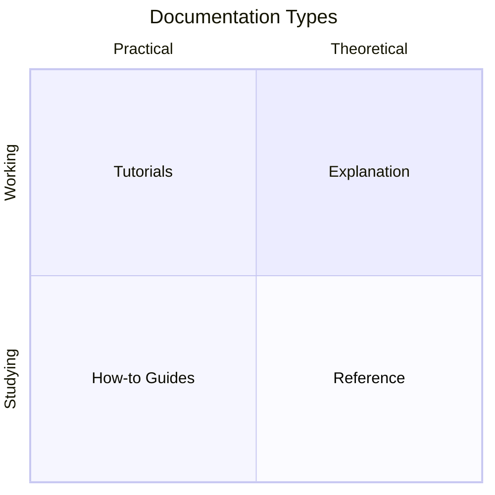

import { Card, Cards } from "fumadocs-ui/components/card";
import { Callout } from "fumadocs-ui/components/callout";
import { Tab, Tabs } from "fumadocs-ui/components/tabs";

# 📝 Documentation Standards

<Callout type="info">
  This guide outlines standards for creating and maintaining documentation that
  follows the **Diátaxis framework** and industry best practices.
</Callout>

## Diátaxis Framework

Our documentation follows the [Diátaxis framework](https://diataxis.fr/), which organizes content into four distinct types based on user needs:



### The Four Types

<Cards>
  <Card
    title="📚 Tutorials"
    description="Learning-oriented. Take users through steps to complete a project."
  />
  <Card
    title="📖 How-to Guides"
    description="Problem-oriented. Show how to solve specific problems."
  />
  <Card
    title="📋 Reference"
    description="Information-oriented. Technical descriptions of the machinery."
  />
  <Card
    title="💡 Explanation"
    description="Understanding-oriented. Clarify and illuminate concepts."
  />
</Cards>

| Type              | User Need                | Our Sections    |
| ----------------- | ------------------------ | --------------- |
| **Tutorials**     | "I want to learn"        | Getting Started |
| **How-to Guides** | "I want to accomplish X" | Guides          |
| **Reference**     | "I need to look up Y"    | Reference       |
| **Explanation**   | "I want to understand Z" | Learning        |

---

## Writing Guidelines

### Voice and Tone

<Tabs items={["✅ Do", "❌ Don't"]}>
  <Tab value="✅ Do">
    - **Be direct**: "Run this command" not "You might want to run" - **Be
    helpful**: Anticipate questions and answer them - **Be inclusive**: Avoid
    jargon without explanation - **Use second person**: "You can..." not "Users
    can..." - **Be concise**: Remove unnecessary words
  </Tab>
  <Tab value="❌ Don't">
    - **Don't be vague**: "Simply do X" - nothing is simple for beginners -
    **Don't assume**: Explain prerequisites clearly - **Don't be wordy**: Get to
    the point - **Don't be condescending**: Avoid "obviously" or "just" -
    **Don't use passive voice**: "The file is created" → "Create the file"
  </Tab>
</Tabs>

### Code Examples

```tsx
// ✅ Good: Complete, runnable example with context
// src/components/user-card.tsx
import { Card } from "@/components/ui/card";

interface UserCardProps {
  name: string;
  email: string;
}

export function UserCard({ name, email }: UserCardProps) {
  return (
    <Card className="p-4">
      <h3 className="font-semibold">{name}</h3>
      <p className="text-muted-foreground">{email}</p>
    </Card>
  );
}
```

**Code example requirements:**

- [ ] Include file path comment
- [ ] Show necessary imports
- [ ] Use TypeScript types
- [ ] Include comments for complex logic
- [ ] Make examples copy-paste ready

### Formatting Standards

#### Headings

```markdown
# Page Title (H1 - one per page)

## Major Section (H2)

### Subsection (H3)

#### Minor heading (H4 - use sparingly)
```

#### Lists

- Use bullet points for unordered items
- Use numbered lists for sequential steps
- Keep list items parallel in structure

#### Callouts

```mdx
<Callout type="info">General information or tips</Callout>

<Callout type="warn">Warning about potential issues</Callout>

<Callout type="error">Critical warnings or destructive actions</Callout>

<Callout type="note">Additional context or notes</Callout>
```

---

## Page Structure Template

Every documentation page should follow this structure:

```mdx
---
title: Page Title
description: One-sentence description (shown in search results)
keywords: ["relevant", "keywords", "for", "search"]
difficulty: beginner | intermediate | advanced
estimatedTime: "15 min"
---

import { Components } from "fumadocs-ui/components/...";

# Page Title

<Callout type="info">
  Brief introduction explaining what the reader will learn.
</Callout>

## Prerequisites (if applicable)

- Prerequisite 1
- Prerequisite 2

## Main Content

Content organized with clear headings...

## Summary (if appropriate)

Key takeaways...

## 👉 Next Steps

- Link to related guide 1
- Link to related guide 2
```

---

## MDX Components

### Available Components

| Component   | Use Case                        |
| ----------- | ------------------------------- |
| `<Callout>` | Highlight important information |
| `<Cards>`   | Grid of navigation cards        |
| `<Card>`    | Single navigation card          |
| `<Tabs>`    | Tabbed content sections         |
| `<Tab>`     | Individual tab content          |
| `<Steps>`   | Numbered step-by-step guide     |
| `<Step>`    | Individual step                 |

### Usage Examples

```mdx
{/* Navigation Cards */}

<Cards>
  <Card title="Card Title" href="/docs/path" description="Brief description" />
</Cards>

{/* Tabs */}

<Tabs items={["Tab 1", "Tab 2"]}>
  <Tab value="Tab 1">Content for tab 1</Tab>
  <Tab value="Tab 2">Content for tab 2</Tab>
</Tabs>

{/* Steps */}

<Steps>
  <Step>### Step Title Step content here.</Step>
</Steps>
```

---

## File Naming

| Type        | Convention         | Example                      |
| ----------- | ------------------ | ---------------------------- |
| Pages       | kebab-case         | `getting-started.mdx`        |
| Index pages | `index.mdx`        | `index.mdx`                  |
| ADRs        | `adr-XXX-name.mdx` | `adr-001-tanstack-query.mdx` |

---

## Cross-Referencing

### Internal Links

```mdx
{/* Always use relative paths */}
[Link Text](/docs/reference/component-library)

{/* Link to specific section */}
[Section Link](/docs/reference/component-library#add-component-variants)
```

### External Links

```mdx
{/* External links should indicate they open in new tab */}
[React Documentation](https://react.dev)
```

---

## Review Checklist

Before submitting documentation:

- [ ] Content follows Diátaxis framework
- [ ] Frontmatter is complete (title, description, keywords)
- [ ] Code examples are tested and work
- [ ] Links are valid and not broken
- [ ] Images have alt text
- [ ] Spelling and grammar checked
- [ ] Page renders correctly locally
- [ ] Navigation updated in `meta.json`

---

## Contributing Documentation

1. **Create branch**: `docs/topic-name`
2. **Write content**: Follow this guide
3. **Test locally**: Run `pnpm dev`
4. **Submit PR**: Include description of changes
5. **Address feedback**: From documentation review
6. **Merge**: Once approved

---

## Resources

<Cards>
  <Card
    title="📖 Diátaxis Framework"
    description="Learn the documentation philosophy we follow"
    href="https://diataxis.fr/"
  />
  <Card
    title="✍️ Google Developer Style Guide"
    description="Industry-standard technical writing reference"
    href="https://developers.google.com/style"
  />
  <Card
    title="📚 Write the Docs"
    description="Community documentation best practices"
    href="https://www.writethedocs.org/guide/"
  />
</Cards>
